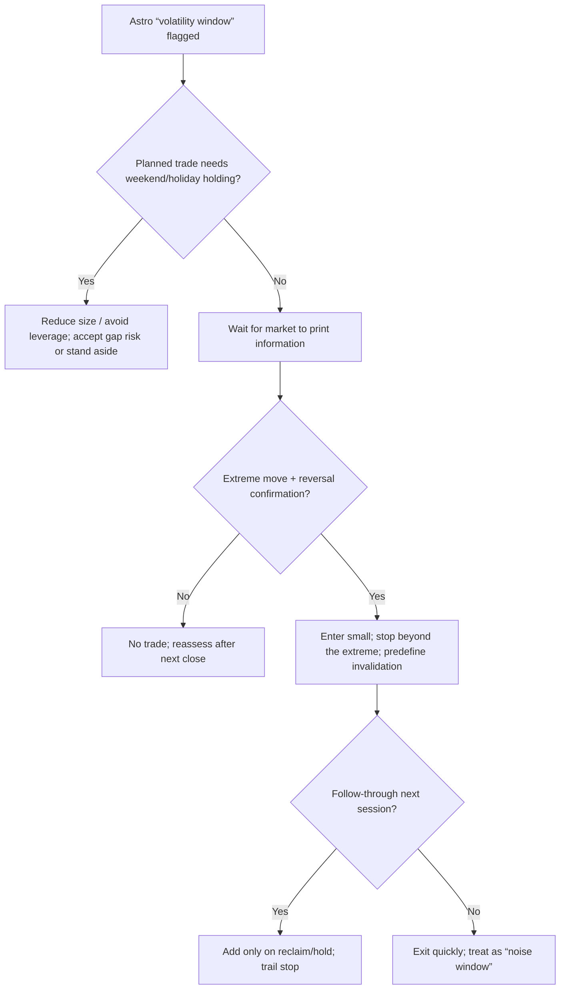

# Do deep research on Mercury retrograde and financial markets

## Executive summary
Peer‑reviewed evidence for **astrology → market direction** is weak and inconsistent; the best‑documented patterns are **small, time‑varying calendar anomalies** that are highly vulnerable to **multiple testing** and **data‑snooping**. A prominent working paper finds **~3.33% annualized lower equity index returns during Mercury retrograde** across 48 countries and argues for an **investor‑belief/participation channel**, not a physical mechanism. citeturn7view0turn17view1 By contrast, other studies find **lower volatility** (US) or even **positive effects** (India), and larger “astrology” constructs (e.g., zodiac years) typically **fail robustness tests**. citeturn10view0turn10view1turn29view0 Practical takeaway: treat “astro windows” as a **risk‑awareness/volatility hypothesis**, not a directional signal; trade only with **price confirmation and strict sizing**. citeturn21view0turn11view0turn12view0

## What academic work says about astro events
Mercury retrograde: Qi–Wang–Zhang (working paper, R&R noted by author page) tests 48 country indexes (1973–2019), reporting **annualized returns ~3.33% lower in retrograde periods**, and explicitly contrasts an “astrological theory” vs **investor belief** channel (reduced participation → higher required risk premium). citeturn7view0turn17view1turn17view2turn3search7 Murgea (2016) finds the opposite of popular lore on one dimension: **lower return volatility** during retrograde in US data, consistent with traders avoiding activity. citeturn10view0 A Springer journal article on India (1998–2018) using EGARCH reports **asymmetry/leverage effects** and a **positive impact** of Mercury retrograde on returns—illustrating how results can flip by market, model, and specification. citeturn10view1

Eclipses/planetary constructs: There is limited market‑return work, but there is credible evidence of **behavioral impact** around eclipses in information intermediaries: Chen (2021) finds analysts **issue more pessimistic earnings forecasts after lunar eclipses**, with attention/superstition channels explored. citeturn10view2 For broader “zodiac” timing, Phoeng & Swinkels (2016) examine US factor returns (1927–2015) and conclude statistical tests **cannot reject equal returns across zodiac years**, warning that running many regressions raises false positives. citeturn29view0turn11view0 Lunar phases (often grouped with “astro” trading) have the strongest academic footprint: Yuan–Zheng–Zhu (48 countries) estimate **3–5%/yr lower returns around full moons vs new moons**, with Newey‑West t‑stats and bootstrap p‑values reported; they also argue the effect is not explained by volatility/volume shifts. citeturn9view0turn9view2 Dichev–Janes similarly report new‑moon returns about **double** full‑moon returns and little evidence in volatility/volume. citeturn7view1turn7view2

## How to test it correctly
Use standard **event‑study** structure: define event windows (e.g., retrograde start/end; optional “shadow” windows), estimate expected returns via market model/factor model, and test abnormal returns/volatility in tight windows. citeturn21view0turn21view1 Daily event studies are generally well‑specified, but volatility clustering/autocorrelation and cross‑sectional dependence matter; robust SEs and variance modeling help. citeturn21view1 Key metrics: mean returns, realized volatility, volume/turnover, skew/kurtosis, jump frequency, gap risk, and tail loss counts (e.g., % of days < −2σ). citeturn21view1turn19search2

Pitfalls dominate this topic: calendar rules are classic **data‑mining traps**—nominally “significant” patterns often vanish when evaluated against the full universe of searched rules (bootstrap “reality‑check” logic). citeturn11view0 Multiple‑testing standards should be stricter than t≈2; Harvey–Liu–Zhu argue new findings often need **t > 3** to clear false‑discovery risk. citeturn12view0 Also guard against look‑ahead bias (using published astro calendars is fine; using “best” orbs/angles chosen after observing returns is not), calendar clustering (retrogrades overlap with seasonals/holidays), and confounds (macro releases, Fed days). citeturn11view0turn29view0

## Why “astro windows” might coincide with moves
The only plausible mechanisms are **behavioral/attention**. Qi–Wang–Zhang explicitly test an investor‑belief channel and use **Google Trends** query intensity as a belief proxy. citeturn17view2turn12view1 Investor attention is measurable: search volume is a “revealed attention” signal, and attention shocks predict short‑term price pressure and later reversal. citeturn12view1turn11view3 Retail investors in particular are net buyers of “attention‑grabbing” stocks (news/extreme moves/high volume). citeturn14view0 A real‑world illustration: Barron’s reported unusually light trading volume during US solar‑eclipse “mania,” consistent with distraction/attention reallocation (not direction). citeturn4news48

Broader mood effects exist in finance (sunshine, SAD), reinforcing that **sentiment can move prices** even if the celestial “cause” is indirect. citeturn30view0turn31view0

## Trading implications and a DIY test plan
Do not trade Mercury retrograde as a directional edge unless you’ve proven it out‑of‑sample; treat it as a **volatility/whipsaw regime alert**. Keep exposure smaller into long weekends/holidays, avoid leverage, and wait for confirmation (break/reclaim, reversal candle, volatility crush) before adding. citeturn11view0turn21view1

Empirical test you can run: pick broad proxies (SPY, QQQ, IWM), metals (GLD, SLV), miners (GDX, GDXJ), and a volatility measure (VIX; for metals, ETF IV if available). Use 1999–2025 daily data. Build a binary indicator for retrograde days (pre‑published calendars). Compare (a) mean return, (b) realized vol, (c) gap frequency, (d) worst 1% tail days, using Newey‑West SEs and a block bootstrap. Then run placebo tests with randomized “pseudo‑retrograde” windows matched on month and day‑of‑week; pre‑register a single primary metric to reduce p‑hacking; require t>3 or Holm/FDR correction if you test multiple assets/metrics. citeturn21view0turn11view0turn12view0 Expected sample size: Mercury retrograde ~3–4×/yr × ~15–20 trading days ⇒ ~60–80 retrograde trading days/year; over 25 years ~1,500–2,000 event‑days (enough to detect small bps/day effects, but also enough to inflate false discoveries if you test many variants). citeturn17view0turn11view0

### Key studies snapshot
| Study | Event | Dataset | Main finding |
|---|---|---|---|
| Qi–Wang–Zhang (2021 WP) | Mercury retrograde | 48 country indexes (1973–2019) | ~**3.33% annual** return shortfall; belief/participation channel citeturn7view0turn17view1 |
| Murgea (2016) | Mercury retrograde | US market | **Lower volatility** during retrograde citeturn10view0 |
| Springer (India, 1998–2018) | Mercury retrograde | Nifty50/Sensex | EGARCH: **asymmetry** + **positive return impact** citeturn10view1 |
| Yuan–Zheng–Zhu (2006) | Lunar phases | 48 countries | Full‑moon vs new‑moon: **3–5%/yr**; bootstrap p≈0.00–0.07 citeturn9view0turn9view2 |
| Dichev–Janes (2001/03) | Lunar phases | US + 24 countries | New‑moon returns ~**double** full‑moon; little vol/volume effect citeturn7view1turn7view2 |
| Phoeng–Swinkels (2016) | Zodiac years | US factors (1927–2015) | Cannot reject equal returns; warns on multiple tests citeturn29view0 |

